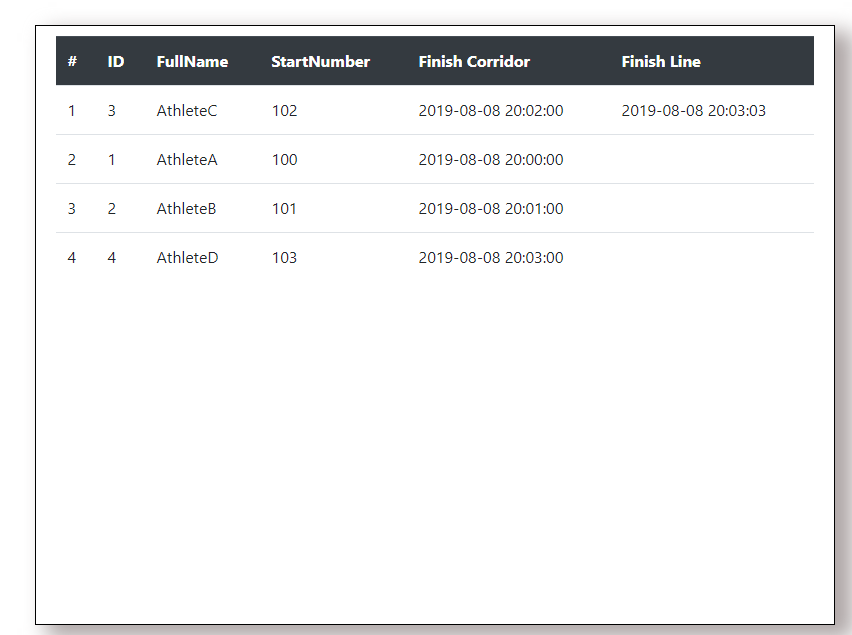
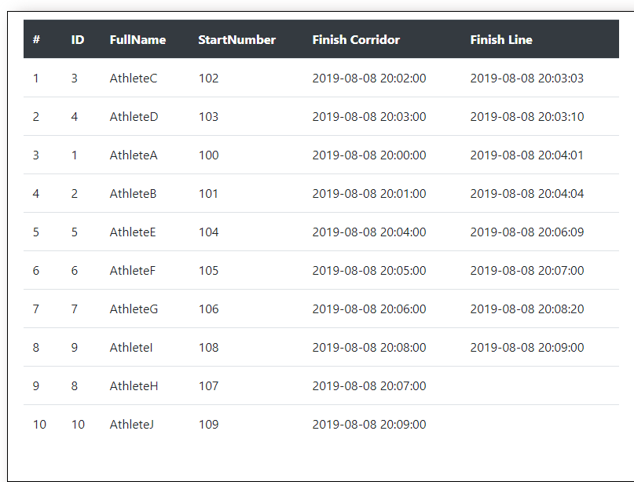

# Timing System

~~*Note: It does not support docker yet.*~~   
*Note: It supports docker .*

#### Table of Contents

* [Timing System](#timing-system)   
  * [Picture of Logic](#picture-of-logic)  
  * [Usage](#usage)  
  * [Docker](#docker)
  * [Screens](#screens)
  * [Background Of The Project](#background-of-the-project)  
  * [Tasks Description](#tasks-description)  
  * [Package Requirements](#package-requirements)
  * [Directory Structure](#directory-structure)  
  * [Reference](#reference)  

## Picture of Logic
This is the logic of the project.
<!--  -->


## Usage (Tested on Linux)

#### Start Timing Server
Enter the `timingserver` folder, and run the following command:
```go
// Build the project with go modules.
go build && ./timingserver
```
or
```go
// In $GOPATH/src
go run timingserver/main.go
```

#### Open Websocket client
open your browser, input the following address to your browser an open the web-end. This is a websocket client and it will connect server automatically.

if you run the project locally, please input:
```go
localhost:50052
```

if you run the project on your `virtual machine`, please input:
```go
IpOfYourVM:50052
```
or if you want to see a `demo`, please input the following address into your browser:
```go
// It is a docker image of timing server.
// And it run on Google Cloud Platform
http://35.228.42.74:50052/
```

####  Send Dummy Data
Enter `testclient` folder, and then run command:
```go
// Build the test client with go modules.
// Send the dummy data to my docker image of the project on Google Cloud
go build && ./testclient -addr 35.228.42.74:50051
```
or  
```go
// In $GOPATH/src
// Send the dummy data to the local timing service
go run testclient/*.go
```

## Docker
The project supports docker with `Dockerfile`.            
For example, you can use the following command to build the project as a docker image on your Google Cloud.
```bash   
gcloud builds submit --tag gcr.io/The Id of your project on the GoogleCloud/timingsystem-image
```

## Screens

After lunched server, open browser and connect the server.              
         

If you switch to other browser tab or make your browser into background within 5 seconds, the connection won't be disrupted.            
     

If you switch to other browser tab or make your browser into background over 5 seconds, the connection will be disrupted.           
When you switch the browser tab back or make your browser into foreground, the connection will be reconnected.    


When you start timing server, open the websocket client on your browser, and run the test-client to send dummy data to server, you will see the following scenes:              
 






The final records.                 


## Background of The Project
According to the [requirement-1](./docs/requirements/Backend_take_home_test.pdf) and [requirements-2](./docs/requirements/Requirements_of_the_task.png), summarized the following tasks:

## Tasks Description
*First Task*
- [x] Server/service, that receives the timing information in real-time. Protocol is not known at the moment - just design it yourself in the way you wish it. You can’t use the real timing system for testing - create a test-client that sends some dummy data instead.

*Second Task*
- [x] When athlete enters the finish corridor, a corresponding row is added to the table, where the athlete’s start number and name is displayed.

- [x] When the athlete crosses the finish line, the finish time is added to the athlete’s row.

- [x] Design the UI in the way, that the athlete’s who entered to the finish corridor last, would be visible to the user without any effort from the user - the older rows records just move out of the visible area, sequentially.

- [x] Demonstrate the functioning of the system with the test-client that sends the dummy data.

- [x] Try to design the user interface in the way, that user don’t have to put any effort or do any additional moves in order to see something (for example, no need to “refresh” or scroll the page or do any other annoyances), so that he/she would understand adequately what is happening and won’t get confused.

*Extra Tasks*
- [x] Make sure that the athletes who cross the finish-line would be displayed in the correct order - for example, if athlete A enters the finish corridor before athlete B, then they are displayed in the order of entering the corridor. But if athlete B passes the athlete A in the finish corridor (i.e. the athlete B crosses the finish line before the athlete A), then adjust the displayed order accordingly. Demonstrate it with the dummy test-client.

- [x] Do so that the web user interface would interact with the server in real-time only, when the browser window is in foreground / active. If user brings some other application window into foreground, then the web user interface has to stop the communication with the server. I the user activates the web browser window again, the realtime communication with the server must be resumed.

- [x]  If the browser window has been deactivated meantime and the user brings it to foreground again, then, depending on the technical solution, there might be situation where there is a “gap” in the information that has been received from the server (because the communication with the server didn’t happen and the information was not sent). In that case, think / propose, how it could be handled in the user interface so, that user would understand it adequately and won’t get confused.

*Bonus Tasks*
- [x] Docker Compose File

*Documents*
- [x] For Timing Server
- [x] For gRPC


## Package Requirements
- Go-SQLite3
- gRPC
- protoc
- Gorilla WebSocket
- GoDS (Go Data Structures)

*Container*
- docker


## Directory Structure

```go
├── sysprotos
│   ├── timingsystem.pb.go
│   └── timingsystem.proto
├── testclient
│   ├── fakedata.go
│   └── main.go
└── timingserver
    ├── cerror
    │   └── error.go
    ├── data
    │   ├── databuilding.go
    │   ├── databuilding_test.go
    │   ├── dataInitializaion_test.go
    │   ├── dataInitialization.go
    │   └── datastructs.go
    ├── grpc
    │   ├── actions.go
    │   └── main.go
    ├── hubs
    │   └── serverhub.go
    ├── main.go
    ├── utils
    │   └── tools.go
    └── websocket
        ├── home.html
        ├── hub.go
        ├── main.go
        └── wsclient.go
```

### timingserver
- `main.go` for starting the timing server

#### grpc
- `main.go` for starting gRPC server. The file defines RecordTimingPoint method for timingService from gRPC protocal.
- `actions.go`  defines logic for getting records with correct order. And then, send the data to websocket server.

### websocket
- `main.go` for starting websocket server.
- `hub.go` for registering/unregistering websocket clients. And as a broker for broadcasting message from gRPC server to websocket clients and maintain the a copy of the latest records.
- `wesclient.go` defines logics for websocket service. 
- `home.html` defines a template for websocket client. It includes front-end logic of websocket client.

#### data
- `databuilding.go` defines logics for sorting the order of the records
- `dataInitialization.go` defines logics for initializing database. In this project, the database is SQLite.
- `datastructs.go` defines two data structures that are Athletes and athleteInfo. The former one is for storing records. The latter one is for storing data from database.

#### hubs
- `serverhub.go` defines a hub for communicating between gRPC service and WebSocket service.

#### utils
- `tools.go` defines some utility functions.

#### cerror
- `cerror.go` defines a function for output error information.

### sysprotos
- `timingsystem.proto` defines a protocol for accepting dummy data from test-client

### testclient
- `fakedata.go` defines dummy data.
- `main.go` sends dummy data to the gRPC service.

## References

#### Timing Mats

- [Race Timing RFID Mats - How to Setup & Use](https://www.youtube.com/watch?v=MnkCDdUjP5w)

#### Golang

- [The Go Programming Language Specification](https://golang.org/ref/spec)
- [Effective Go](https://golang.org/doc/effective_go.html)
- [How to write Go code](https://golang.org/doc/code.html)
- [Wiki of Go in the Github](https://github.com/golang/go/wiki)
- [Go database/sql tutorial](http://go-database-sql.org/index.html)
- [SQLDrivers - Wiki of Go in the Github](https://github.com/golang/go/wiki/SQLDrivers)
- [SQL Interface - Wiki of Go in the Github](https://github.com/golang/go/wiki/SQLInterface)

#### Docker
- [Quickstart Docker on Google Cloud Platform](https://cloud.google.com/cloud-build/docs/quickstart-docker)

